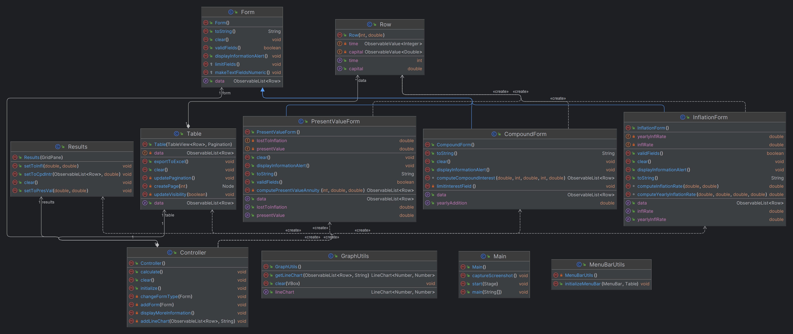
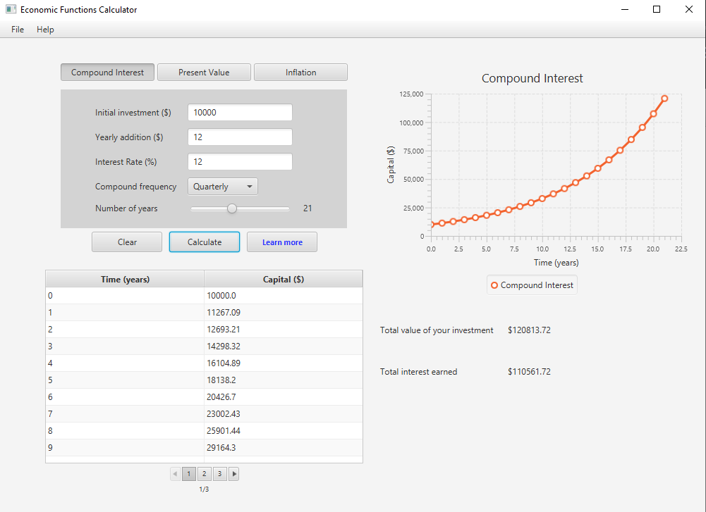
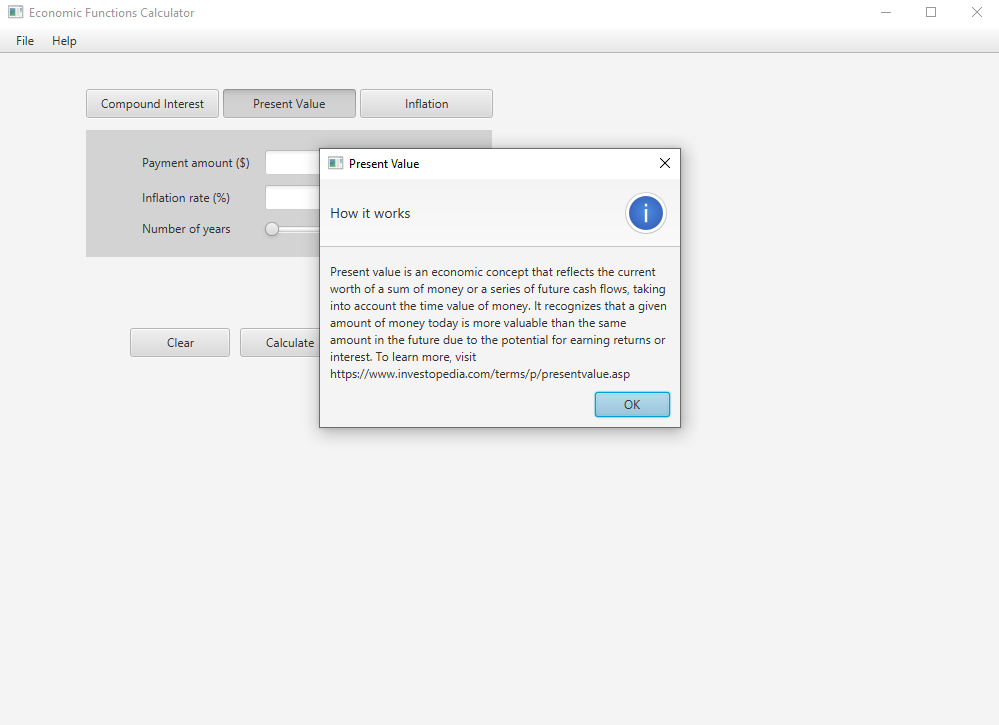
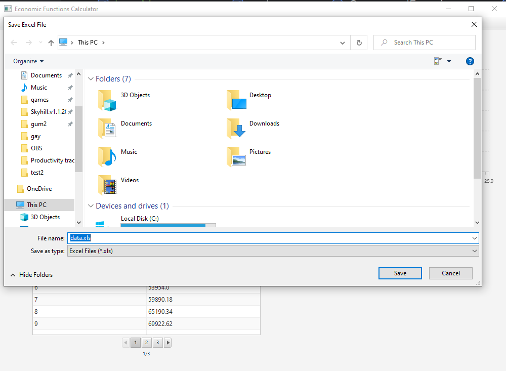

# Economic Calculator JavaFX Project

## How to run the application 

1. `cd {your directory}`
2. `git clone {repo_url}`
3. Run Main.java file in your IDE of choice

## Introduction

This app has the goal of calculating Present Value, Inflation Rate and Compound Interest.
Thus, three different forms are provided to the user to input the necessary information.
After the user calculates the desired value, the resulting data is displayed in a table and graph. 
The user can also save the table into an excel file for further analysis as well as export the graph as a photo.

## Table of contents

1. [Troubleshooting](#troubleshooting)
2. [Previous version & changes made after feedback](#previous-version-&-changes-made-after-feedback)
3. [Results](#results)
4. [Program structure](#program-structure)
5. [Form package](#form-package)
6. [Util pacakage](#util-packaga)
7. [Other classes](#other-classes)
8. [UML diagram](#uml-diagram)
9. [Output images](#output-images)
10. [How git was used](#how-git-was-used)

## Troubleshooting

We preface this by saying that a lot of tests have been run on this app to make it as rigid and polished as possible. However, with every technology can arise a series of issues. In our case, to prevent any errors, we recommend running the project in the IntelliJ IDE. This is the environment we used to create it.

If the project does not compile, the issue is likely with loading the FXML file, because its relative location was altered. We recommend reading the error messages, and to adjust the location of the FXML file accordingly. Additionally, make sure that your machine is running on JDK 18 or higher.

If the screenshot taken does not show the graph, as advertised, simply re-run the program and do not drag or maximise/minimise your application. Take the screenshot again. You will find it in the source directory.

## Previous version & Changes made after feedback

At first when the project was assigned, we had a simpler idea of what we wanted to do.
The sole goal of the application was to calculate Compound Interest and display the results in a table and graph. 
However, due to the program's simplicity, the following feedback was given to us by Miss Nagat Drawel (our professor):

In short, the feedback was to add more features to the application.
Thus, we implemented the additional features that were mentioned in the feedback (Inflation Rate & Present Value
as well as the ability to save the table into an excel file).

Furthermore, we decided to use Git & GitHub as our version source control. 
For more information regarding that, please check [How git was used](#how-git-was-used).

### Results

Everything from the feedback was resolved and implemented into the application except for 
exporting the graph as a photo. This feature was not implemented due to time constraints.

A screenshot of the application is taken instead but it is not ideal.
Errors can be made when taking a screenshot and the graph might not be fully visible as well
as when the screen is not adjusted to the correct size. 

In short, the application can only export the graph as a photo only on some devices & on some occasions.
The other functionalities work as intended.

## Program Structure

The program is split into 3 different packages:

1. `com.compound_calculator.form` - Contains the Form classes (Compound Interest, Inflation Rate & Present Value)
2. `com.compound_calculator.util` - Contains the Utility classes (GraphUtils & MenuBarUtils)
3. `com.compound_calculator` - Contains other classes (Main, Controller, Result, Table & Row)

Now, let's look at each package in more detail.

### Form Package

This package uses inheritance to create the three different forms that have similar functionality.
The Form class is the parent class that contains the common functionality between the three forms.
Each Form has the important method of `getData()` which returns tabular data related to the form's calculations.

### Util Package

This package contains two classes: GraphUtils & MenuBarUtils.
These classes cannot be instantiated and are used to provide utility static methods to other classes.

### Other Classes

The Three important classes outside of Main & Controller are:

1. `Result` - This class is used to store the results of the calculations. (final amount, interest rate, etc.)
2. `Table` - This class contains a tableView and pagination to display the data in a table.
3. `Row` - This class is used to store the data of a single row in the table.

### UML Diagram

## Outputs Images

### Blank Compound Interest Form

### Filled Compound Interest Form

### Learn More Information Alert Dialog

### FileChooser for Saving Table as Excel File

## How git was Used

This git repository is split into two branches: main & parsa. The parsa branch is named after one of the developers of this project (Parsa Jafarian). 
This naming convention is used to determine which branch is assigned to which team member. Mark Rudko, the other developer, at the time of the project development, 
was unfamiliar with git commands and branching. Thus, Parsa split off a branch where he would work on his parts alone and leave Mark onto his duties on main. 
We didn't use pull requests because it would've been taken some time to teach it to Mark. In addition, this is a small team made of two people who communicate
with each other on a day to day basis. 
